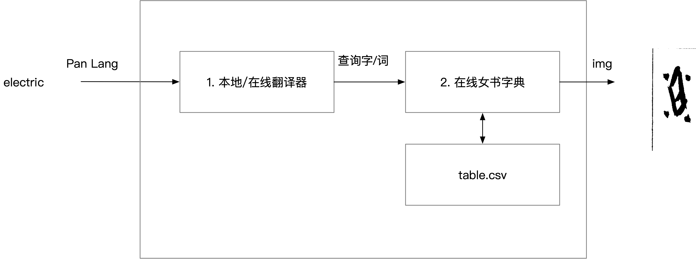

# pan-nvshu-translator
## translator
1. The main translator could be getting from an open source translator like \
   https://github.com/LibreTranslate/LibreTranslate.git \
  https://libretranslate.com/docs/
2. need a backup translator that could be \
   A google translator ? \
   An GPT translator ? \
   or an offline version of https://github.com/LibreTranslate/LibreTranslate.git \
## convertor
1. the convertor in  https://nushuscript.org is just mapping from a chinese character to a nv-shu imgage. The mapping is done directly from a .csv mapping file https://nushuscript.org/nsbzzzd/table.json
2. This can be easily copied to current project
3. Updating: can do automatic updating by detecting https://nushuscript.org/nsbzzzd/table.json changes and copy to current repo

## work flow

## debug/dev
1. use VS code js debug
2. just modify https://nushuscript.org/nsbzzzd

## deployment
TBD, maybe wordpress
